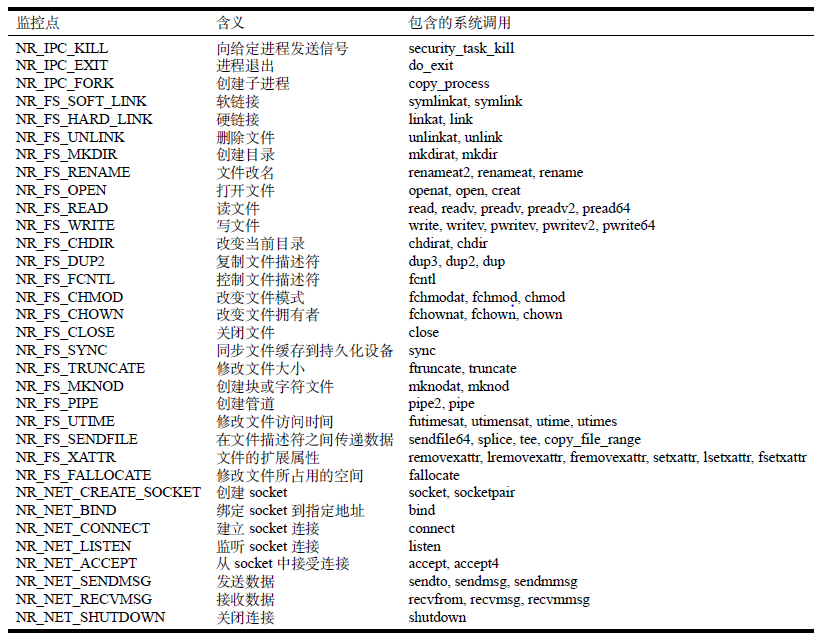

# 1 工作概述

运维人员通过执行运维命令来管理华为云的设备和服务。但是，目前对于命令的执行过程是无法感知的，只能通过命令的执行结果来判断命令的执行是否满足预期。我们希望开发一个在命令执行的过程进行实时监控的工具，并给出在此过程中所影响的数据对象。

# 2 已完成的工作

我们将命令所影响的对象分成三方面来监控：文件、进程和网络。在绝大部分情况下，命令通过系统调用来影响操作系统的对象。因此，只要监控了命令调用的系统调用的参数和返回值后，便可以监控命令的执行过程。我们使用eBPF来监控操作系统的系统调用。

由于命令的执行环境是EulerOS SP3，内核版本是Linux，因此以下部分所说的操作系统指的是Linux系统。

我们使用eBPF中的tracepoint来在系统调用的进入点和退出点设置监控代码，记录和分析。可设置tracepoint的系统调用可以通过如下命令查看。

```
sudo ls /sys/kernel/debug/tracing/events/syscalls
```

注意到操作系统会创建一个进程来执行用户输入的命令，而这个进程会创建多个进程或多个线程。因此，命令的执行过程的监控实际上是要监控随命令的执行而产生的所有进程和线程。在操作系统中，内核线程又被称为轻量级进程(LWP，Light weight process)。和进程一样，操作系统使用PCB来描述线程，而PCB的创建需要通过内核函数`copy_process`来完成。因此，监控了`copy_process`后即可监控命令在执行过程中创建的所有进程和线程。

注意到tracepoint可以监控的系统调用有300多个，并不是所有系统调用都是有助于后续分析的。因此，我们只监控一些重要的系统调用。目前监控的系统调用如下所示。



在命令执行过程中，命令会调用一系列的系统调用。因此，只要实时解析系统调用的参数和返回值，最后再将其综合，即可得到命令在执行过程中影响的数据对象。

# 3 未完成的工作

运维人员执行的命令大致可以分为两种类型。

第一种是传统的OS命令，如ls，cat等。此类命令在执行的时候，操作系统会找到对应的可执行文件，然后创建进程来执行这个可执行文件。在命令执行过程中涉及的所有进程和线程都是在命令执行的时候产生的，并在命令执行完成后退出。

第二种是服务类命令，如docker，kubectl等。此类命令会通过Unix Socket等方式和守护进程进行交互，命令的执行是通过守护进程来完成的。守护进程在命令执行完成后不会退出，而是等待下一命令的到来。

对于第一种命令，目前的工作已经可以很好地进行监控。但对于第二种命令的监控，目前还在开发当中。其难点有两个，第一在于如何找到和命令通信的守护进程并将其纳入监控范围中，第二守护进程可能将任务分发给多个worker进程来执行，而分发的过程是无法感知的。解决难点的关键在于如何建立起守护进程影响的对象和监控的命令之间的对应关系。

目前的工作已经对unix socket和tcp socket的通信过程进行监控，并将进行通信的进程实时纳入到监控列表中，以便后续的分析，从而解决了第一个难点。

但对于第二个难点，目前还没开始研究。

# 4 项目代码说明

本项目基于Ubuntu 20.04和BCC开发，在运行本项目代码之前，需要安装BCC，安装方法为https://github.com/iovisor/bcc/blob/master/INSTALL.md#ubuntu---source

已完成的工作在目录`ebpf`下。创建两个终端，假设终端1的pid是58528，在终端2下输入如下命令启动监控。

```
sudo python3 monitor.py --pid=58528
```

当终端2输出如下信息后，则开始监控。

````
loading bpf code...
Done
time               comm             type  pid    action
````

此时在终端1输入命令如ls，cat，rm，mkdir，ln，vim等均可在终端1中看到相关信息。

目前进行的工作在目录`ebpf-v2`下。创建两个终端，假设终端1的pid是58528，在终端2下输入如下命令启动监控。

```
sudo python3 main.py --pid=58528
```

当终端2输出如下信息后，则开始监控。

````
load bpf code done.
my pid: 58810
program                         pid     tgid     information

````

此时在终端1输入命令如docker info，curl -X POST www.baidu.com 等均可在终端1中看到相关信息，如下所示。

```
program                         pid     tgid     information
bash                            58528   58528    fork new proc, pid: 58811, tgid: 58811
ls                              58811   58811    exit
bash                            58528   58528    fork new proc, pid: 58812, tgid: 58812
docker                          58812   58812    fork new proc, pid: 58813, tgid: 58812
docker                          58812   58812    fork new proc, pid: 58814, tgid: 58812
docker                          58812   58812    fork new proc, pid: 58815, tgid: 58812
docker                          58814   58812    fork new proc, pid: 58816, tgid: 58812
docker                          58812   58812    fork new proc, pid: 58817, tgid: 58812
docker                          58812   58812    fork new proc, pid: 58818, tgid: 58812
docker                          58815   58812    fork new proc, pid: 58819, tgid: 58812
docker                          58812   58812    fork new proc, pid: 58820, tgid: 58812
docker                          58819   58812    fork new proc, pid: 58821, tgid: 58812
docker                          58812   58812    proc 58812 recv bytes from proc 1 via unix socket
docker                          58814   58812    proc 58814 send bytes to proc 1 via unix socket
dockerd                         1216    1166     proc 1166 recv bytes from proc 58812 via unix socket
dockerd                         1267    1166     proc 1166 recv bytes from proc 58812 via unix socket
dockerd                         1216    1166     proc 1216 send bytes to proc 58812 via unix socket
dockerd                         1216    1166     proc 1166 recv bytes from proc 58812 via unix socket
docker                          58817   58812    proc 58812 recv bytes from proc 1 via unix socket
docker                          58817   58812    proc 58812 recv bytes from proc 1 via unix socket
docker                          58812   58812    proc 58812 send bytes to proc 1 via unix socket
dockerd                         1260    1166     proc 1166 recv bytes from proc 58812 via unix socket
dockerd                         1267    1166     proc 1166 recv bytes from proc 58812 via unix socket
dockerd                         1260    1166     fork new proc, pid: 58822, tgid: 58822
runc                            58822   58822    fork new proc, pid: 58823, tgid: 58822
runc                            58822   58822    fork new proc, pid: 58824, tgid: 58822
runc                            58822   58822    fork new proc, pid: 58825, tgid: 58822
runc                            58824   58822    fork new proc, pid: 58826, tgid: 58822
runc                            58822   58822    fork new proc, pid: 58827, tgid: 58822
runc                            58826   58822    fork new proc, pid: 58828, tgid: 58822
runc                            58822   58822    exit
runc                            58823   58822    exit
runc                            58824   58822    exit
runc                            58828   58822    exit
runc                            58827   58822    exit
runc                            58825   58822    exit
runc                            58826   58822    exit
dockerd                         1260    1166     proc 1260 send bytes to proc 1016 via unix socket
dockerd                         1266    1166     proc 1166 recv bytes from proc 1016 via unix socket
dockerd                         1260    1166     proc 1260 send bytes to proc 1016 via unix socket
dockerd                         1266    1166     proc 1166 recv bytes from proc 1016 via unix socket
dockerd                         1266    1166     proc 1166 recv bytes from proc 1016 via unix socket
dockerd                         1260    1166     fork new proc, pid: 58829, tgid: 58829
docker-init                     58829   58829    exit
dockerd                         1266    1166     proc 1266 send bytes to proc 58812 via unix socket
dockerd                         1266    1166     proc 1166 recv bytes from proc 58812 via unix socket
docker                          58819   58812    proc 58812 recv bytes from proc 1 via unix socket
docker                          58819   58812    proc 58812 recv bytes from proc 1 via unix socket
docker                          58812   58812    fork new proc, pid: 58830, tgid: 58830
docker-buildx                   58830   58830    fork new proc, pid: 58831, tgid: 58830
docker-buildx                   58830   58830    fork new proc, pid: 58832, tgid: 58830
docker-buildx                   58830   58830    fork new proc, pid: 58833, tgid: 58830
docker-buildx                   58832   58830    fork new proc, pid: 58834, tgid: 58830
docker-buildx                   58830   58830    fork new proc, pid: 58835, tgid: 58830
docker-buildx                   58830   58830    fork new proc, pid: 58836, tgid: 58830
docker-buildx                   58832   58830    fork new proc, pid: 58837, tgid: 58830
docker-buildx                   58830   58830    fork new proc, pid: 58838, tgid: 58830
docker-buildx                   58838   58830    exit
docker-buildx                   58832   58830    exit
docker-buildx                   58837   58830    exit
docker-buildx                   58831   58830    exit
docker-buildx                   58830   58830    exit
docker-buildx                   58836   58830    exit
docker-buildx                   58834   58830    exit
docker-buildx                   58833   58830    exit
docker-buildx                   58835   58830    exit
docker                          58821   58812    fork new proc, pid: 58839, tgid: 58839
docker-scan                     58839   58839    fork new proc, pid: 58840, tgid: 58839
docker-scan                     58839   58839    fork new proc, pid: 58841, tgid: 58839
docker-scan                     58839   58839    fork new proc, pid: 58842, tgid: 58839
docker-scan                     58841   58839    fork new proc, pid: 58843, tgid: 58839
docker-scan                     58839   58839    fork new proc, pid: 58844, tgid: 58839
docker-scan                     58843   58839    fork new proc, pid: 58845, tgid: 58839
docker-scan                     58842   58839    exit
docker-scan                     58844   58839    exit
docker-scan                     58843   58839    exit
docker-scan                     58840   58839    exit
docker-scan                     58841   58839    exit
docker-scan                     58839   58839    exit
docker-scan                     58845   58839    exit
docker                          58821   58812    fork new proc, pid: 58846, tgid: 58846
docker-app                      58846   58846    fork new proc, pid: 58847, tgid: 58846
docker-app                      58846   58846    fork new proc, pid: 58848, tgid: 58846
docker-app                      58848   58846    fork new proc, pid: 58849, tgid: 58846
docker-app                      58846   58846    fork new proc, pid: 58850, tgid: 58846
docker-app                      58846   58846    fork new proc, pid: 58851, tgid: 58846
docker-app                      58848   58846    fork new proc, pid: 58852, tgid: 58846
docker-app                      58852   58846    fork new proc, pid: 58853, tgid: 58846
docker-app                      58846   58846    fork new proc, pid: 58854, tgid: 58846
docker-app                      58847   58846    exit
docker-app                      58846   58846    exit
docker-app                      58850   58846    exit
docker-app                      58849   58846    exit
docker-app                      58851   58846    exit
docker-app                      58848   58846    exit
docker-app                      58852   58846    exit
docker-app                      58853   58846    exit
docker-app                      58854   58846    exit
docker                          58814   58812    exit
docker                          58812   58812    exit
docker                          58821   58812    exit
docker                          58815   58812    exit
docker                          58820   58812    exit
docker                          58813   58812    exit
docker                          58817   58812    exit
docker                          58818   58812    exit
docker                          58819   58812    exit
docker                          58816   58812    exit
```


